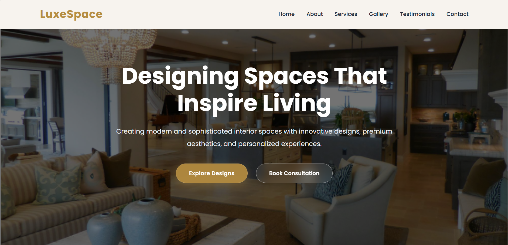
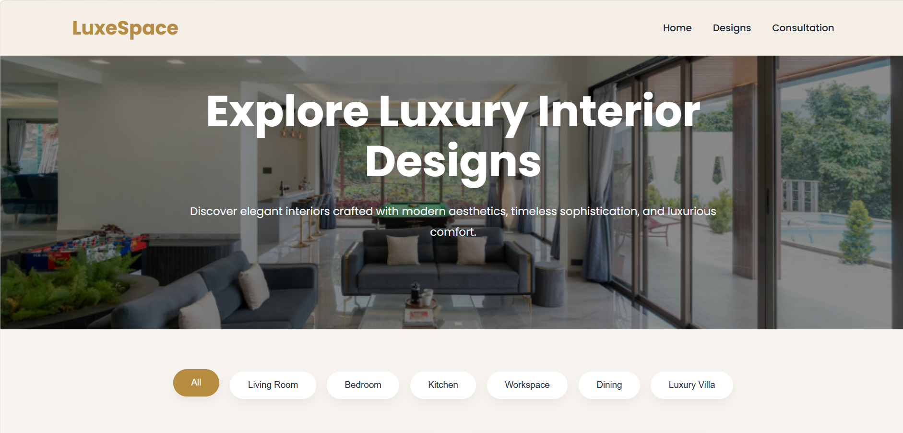
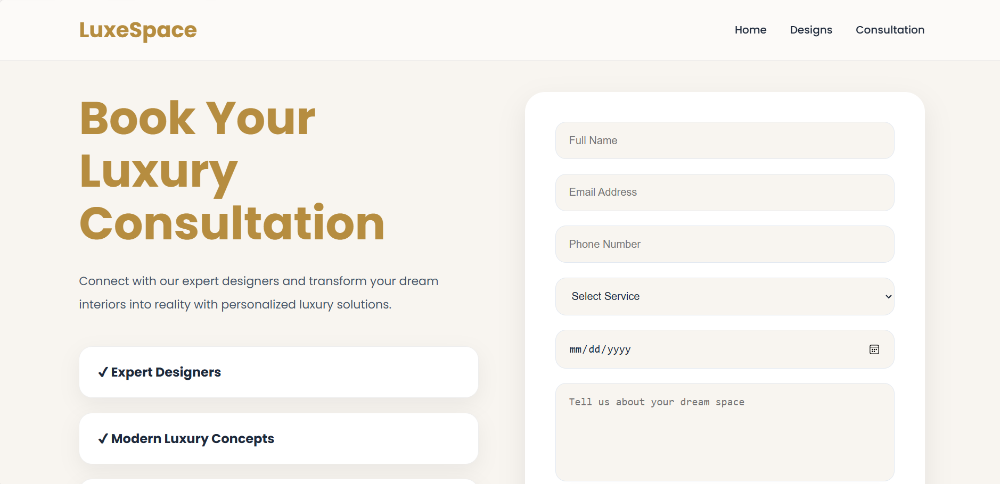

# LuxeSpace Interiors

A modern luxury interior design website built using HTML, CSS, and JavaScript.  
LuxeSpace Interiors showcases elegant interior concepts with a premium beige-and-gold aesthetic, interactive gallery filtering, responsive layouts, and a modern consultation booking experience.

---

## Live Demo

🔗 [ https://your-vercel-link.vercel.app/](https://luxury-interior-website-ten.vercel.app/index.html)

---

## Features

- Modern luxury UI/UX design
- Fully responsive website
- Mobile hamburger navigation
- Interactive design gallery filtering
- Smooth hover animations
- Multi-page website structure
- Consultation booking form
- Elegant beige & gold color palette
- Premium card layouts and transitions

---

## Pages

### Home Page
- Hero section
- About section
- Services
- Testimonials
- Contact section

### Explore Designs Page
- Luxury interior gallery
- Category filtering using JavaScript
- Hover overlay effects

### Consultation Page
- Responsive consultation form
- Luxury modern layout
- Interactive mobile navbar

---

## Technologies Used

- HTML5
- CSS3
- JavaScript
- Font Awesome
- Google Fonts

---

## Folder Structure

```bash
LuxeSpace/
│
├── index.html
├── designs.html
├── consultation.html
│
├── style.css
├── designs.css
├── consultation.css
│
├── README.md
│
└── images/
    ├── gallery1.png
    ├── gallery2.png
    ├── gallery3.png
    ├── gallery4.png
    ├── gallery5.png
    ├── gallery6.png
    └── screenshots/
        ├── home.png
        ├── designs.png
        └── consultation.png
```

---

## Screenshots

### Home Page



---

### Designs Page



---

### Consultation Page



---

## How To Run Locally

1. Clone the repository

```bash
git clone https://github.com/harshithaadicherla10/luxury-interior-website.git
```

2. Open the project folder

3. Run `index.html` using Live Server in VS Code

---

## Future Improvements

- Backend integration for consultation form
- Dark mode support
- Advanced animations
- Database connectivity
- Real project detail pages

---

## Author

### Harshitha Adicherla

GitHub:  
https://github.com/harshithaadicherla10

---

## License

This project is created for educational and portfolio purposes.
